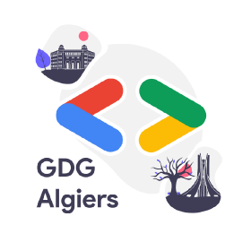
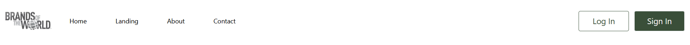
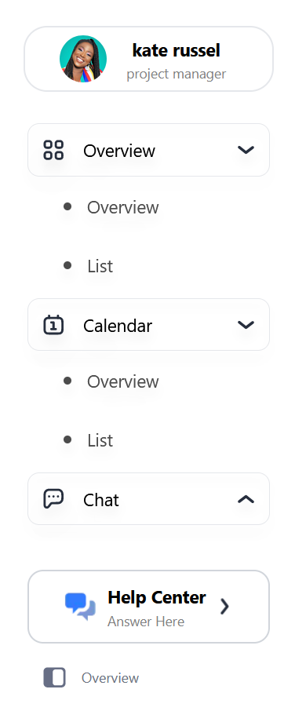
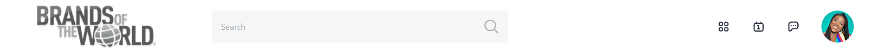
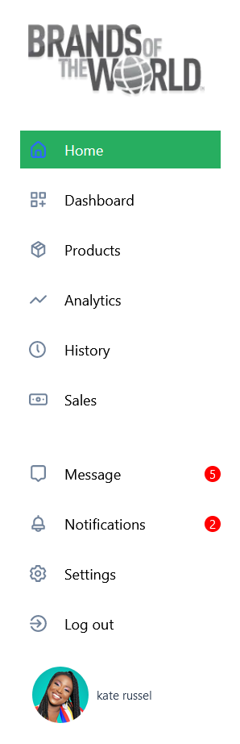
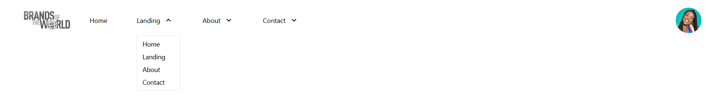
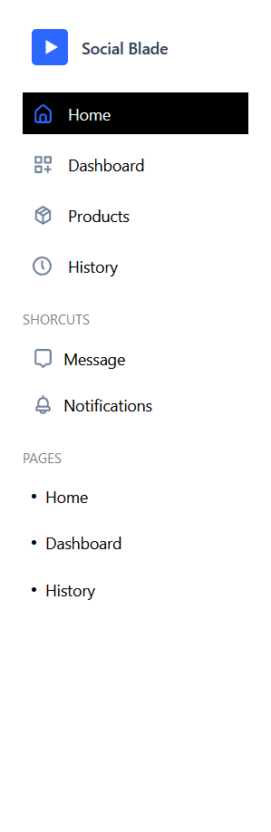
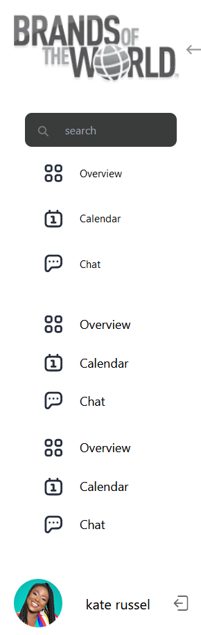

[![Contributors][contributors-shield]][contributors-url]
[![Forks][forks-shield]][forks-url]
[![Stargazers][stars-shield]][stars-url]
[![MIT License][license-shield]][license-url]

<!-- PROJECT LOGO -->
<br />
<p align="center">
   <a href="https://github.com/GDGAlgiers/web-navigation-package"></a>
  <h3 align="center">Web Navigation Package</h3>

  <p align="center">
The Repository for Web Navigation Package made using 
    <a href="https://nextjs.org/">Next.js</a>, <a href="https://tailwindcss.com/">Tailwind CSS</a> and <a href="https://www.typescriptlang.org/">Typescript</a>
    <br />
    <br />
    <a href="https://github.com/GDGAlgiers/web-navigation-package">View Demo</a>
    ·
    <a href="https://github.com/GDGAlgiers/web-navigation-package/issues">Report Bug</a>
    ·
    <a href="https://github.com/GDGAlgiers/web-navigation-package/issues">Request Feature</a>
  </p>

<!-- TABLE OF CONTENTS -->
<details open="open">
  <summary><h2 style="display: inline-block">Table of Contents</h2></summary>
  <ol>
    <li>
      <a href="#about-the-project">About The Project</a>
      <ul>
        <li><a href="#built-with">Built With</a></li>
      </ul>
    </li>
    <li>
      <a href="#getting-started">Getting Started</a>
    </li>
    <li>
      <a href="#usage">Usage</a>
      <ul>
        <li><a href="#installation">Developme</a></li>
        <li><a href="#installation">Installation</a></li>
      </ul>
    </li>
    <li>
      <a href="#list-of-components">List of components</a>
      <ul>
        <li><a href="#linkexplorer">LinkExplorer</a></li>
        <li><a href="#edgesidebar">EdgeSidebar</a></li>
        <li><a href="#edgenavbar">EdgeNavbar</a></li>
        <li><a href="#sidebarpanel">SidebarPanel</a></li>
        <li><a href="#interactivenavbar">InteractiveNavbar</a></li>
        <li><a href="#quicksidebar">QuickSidebar</a></li>
        <li><a href="#sidebarwithsearch">SideBarWithSearch</a></li>
      </ul>
    </li>
    <li><a href="#join-our-community">Join our community</a></li>
    <li><a href="#contributing">Contributing</a></li>
    <li><a href="#license">License</a></li>
    <li><a href="#contact">Contact</a></li>
  </ol>
</details>

<!-- ABOUT THE PROJECT -->

<a name="about-the-project"></a>

# About The Project

GDG Algiers Web navigation package is a free, open source multipurpose set of customizable Side and Navbars to use, maintain and develop by the open source community in order to speed the development process of a specific project.

<a name="built-with"></a>

### Built With

- [Next.js](https://nextjs.org/)
- [Tailwind.css](https://tailwindcss.com/)
- [Typescript](https://www.typescriptlang.org/)

<!-- GETTING STARTED -->

<a name="getting-started"></a>

# Getting Started

To get a local copy up and running follow these simple steps.

<a name="installation"></a>

### Installation

If you're willing to maintain or develop the package you can follow the following steps

1. Clone the repo and cd to it

```sh
git clone https://github.com/GDGAlgiers/web-navigation-package.git
cd web-navigation-package
```

2. Install Requirements

```sh
npm install
```

3. Install Requirements 

```sh
npm run dev
```

4. All components are listed in the components directory inside the src folder, to test how the component works, you can check the `app.tsx` file in the `pages folder` where we added all the components with comments to get to know how props working...

<!-- USAGE EXAMPLES -->

<a name="usage"></a>

# Usage

1. First you have to install the package using the command

```sh
npm install gdg-navigation-components
```

2. Import the component you want to your file

```tsx
import { LinkExplorer, EdgeSidebar, EdgeNavbar, SidebarPanel, InteractiveNavbar, QuickSidebar, SideBarWithSearch } from "gdg-navigation-components";

//use the component imported, check the list of components section to know how components works

<EdgeSidebar
  links={
    [
      {
        link: [
          {
            link: "overview",
            name: "Overview",
            icon: "1",
          },
        ],
        name: "Overview",
        icon: Overview,
        currentLink: "/"
      },
      {
        link: [],
        name: "Chat",
        icon: Chat,
        currentLink: "/chat"
      }
    ]
  }
  generaleStyles={{
    textSize: "0.9rem",
    logoTextSize: "1.25rem",
    textColor: "black",
    activeTextColor: "white",
    background: "white",
    activeBg: "#27AE60",
    ButtonColor: "#3A4F39",
  }}
  user={user}
/>
```

3. Use other components and Enjoy!

<!-- List Of Components -->

<a name="list-of-components"></a>

# List Of Components

The project contains a set of **7 Nav and Sidebar components** where each component got specific usage, design, props and more configurations to use, you find bellow the details of each component:

<a name="linkexplorer"></a>

<details>
  <summary> LinkExplorer </summary>

# Description

LinkExplorer is a responsive React/Next functional component for a navigation bar.

## Screenshot

<a href="https://github.com/GDGAlgiers/web-navigation-package"></a>

## Usage

```tsx
 import UserProfileImage from "my_image_source1"
 import {HomeIcon, AboutIcon} from "my_icons_source2"
 import YourLogoComponent from "my_image_source3"

 //? stands for optional element
 const LinkExplorerProps = {
   Style: {
     textColor: '#333333',
     ?activeBg: '#f0f0f0',
     ?activeTextColor: '#007bff',
     ?background: '#ffffff',
     textSize: '16px',
     ?HoverTextColor: '#555555',
     ?HoverBgColor: '#f0f0f0',
     ?BackgroundColor: '#ffffff',
     ?ActiveTextColor: '#007bff',
     ?BorderColor: '#dddddd',
     ?ButtonColor: '#3498db',
   },
   links: [
     { name: 'Home', link: '/home' },
     { name: 'About', link: '/about' },
     // Add more links as needed
   ],
   LogoInf: { ?title: 'Company: GDG Algiers', logoIcon: YourLogoComponent },
   menuType: 'Burger',
   loggedIn: false,
   loginRoute: '/login',
   SignInRoute: '/signin',
   User: {
     image: UserProfileImage,
     ?name: 'Okba ALLAOUA',
     ?additionalInfo?: "I am the GDG Open source team leader"
     ?role: "Manager",
   },
 };
 
 <LinkExplorer {...LinkExplorerProps} />
```

</details>

<a name="edgesidebar"></a>

<details>
  <summary> EdgeSidebar </summary>

# Description

EdgeSidebar is a responsive React functional component for a side navigation bar.

## Screenshot

<a href="https://github.com/GDGAlgiers/web-navigation-package"></a>

## Usage

```tsx
  import {HomeIcon, AboutIcon, PageIcon, InfoIcon} from "my_image_source1"
  import UserProfileImage from "my_image_source2"

  //? stands for optional element
  const EdgeSidebarProps = {
    user: {
      image: UserProfileImage,
      ?name: 'Rayan ALLALI',
      ?role: 'Admin',
      ?additionalInfo: "GDG Algiers Open Source Team Lead"
    },
    links: [
      {
        ?icon: HomeIcon,
        name: 'Home',
        link: [
          { ?icon: PageIcon, name: 'Page 1', link: '/page1' },
          { ?icon: PageIcon, name: 'Page 2', link: '/page2' },
        ],
        currentLink: "/"
      },
      {
        ?icon: AboutIcon,
        name: 'About',
        link: [{ ?icon: InfoIcon, name: 'About Us', link: '/about' }],
        currentLink: "/about"
      },
    ],
    generaleStyles: {
      textColor: '#333333',
      ?activeBg: '#f0f0f0',
      ?activeTextColor: '#007bff',
      ?background: '#ffffff',
      textSize: '16px',
      ?HoverTextColor: '#555555',
      ?HoverBgColor: '#f0f0f0',
      ?BackgroundColor: '#ffffff',
      ?ActiveTextColor: '#007bff',
      ?BorderColor: '#dddddd',
      ?ButtonColor: '#3498db',
    },
  };
  
  <EdgeSidebar {...EdgeSidebarProps} />
```

</details>

<a name="edgenavbar"></a>

<details>
  <summary> EdgeNavbar </summary>

# Description

EdgeNavbar is a responsive React functional component for a navigation bar.

## Screenshot

<a href="https://github.com/GDGAlgiers/web-navigation-package"></a>

## Usage

```tsx
import LogoImage from "my_image_source1"
import UserProfileImage from "my_image_source2"

//? stands for optional element
const EdgenavbarProps = {
  avatar: { picture: UserProfileImage, link: 'profile' },
  logo: LogoImage,
  isLoggedIn: true,
  loginButton: { text: 'Get started', link: '/login' },
  links: [
    { name: 'Home', link: '/home' },
    { name: 'About', link: '/about' },
  ],
  generaleStyles: {
    textColor: '#333333',
    ?activeBg: '#f0f0f0',
    ?activeTextColor: '#007bff',
    ?background: '#ffffff',
    textSize: '16px',
    ?HoverTextColor: '#555555',
    ?HoverBgColor: '#f0f0f0',
    ?BackgroundColor: '#ffffff',
    ?ActiveTextColor: '#007bff',
    ?BorderColor: '#dddddd',
    ?ButtonColor: '#3498db',
  },
  mobileSettings: { menuType: 'hamburger' },
};

<EdgeNavbar {...EdgenavbarProps} />
```

</details>

<a name="sidebarpanel"></a>

<details>
  <summary> SidebarPanel </summary>

# Description

SidebarPanel is a responsive React functional component for a side navigation bar.

## Screenshot

<a href="https://github.com/GDGAlgiers/web-navigation-package"></a>

## Usage

```tsx
 import UserProfileImage from "my_image_source1"
 import {HomeIcon, AboutIcon, NotificationIcon} from "my_icons_source2"
 import YourLogoComponent from "my_image_source3"
 
 //? stands for optional element
 const sidenavbarProps = {
   Style: {
     textColor: '#333333',
     ?activeBg: '#f0f0f0',
     ?activeTextColor: '#007bff',
     ?background: '#ffffff',
     textSize: '16px',
     ?HoverTextColor: '#555555',
     ?HoverBgColor: '#f0f0f0',
     ?BackgroundColor: '#ffffff',
     ?ActiveTextColor: '#007bff',
     ?BorderColor: '#dddddd',
     ?ButtonColor: '#3498db',
   },
   links: [
     { ?icon: HomeIcon, name: 'Home', link: '/home' },
     { ?icon: AboutIcon, name: 'About', link: '/about' },
     // Add more links as needed
   ],
   LogoInf: { title: 'GDG Algiers', logoIcon: YourLogoComponent },
   NotifsLinks: [
     { icon: NotificationIcon, name: 'Notifications', link: '/notifications', notif: 3 },
     // Add more notification links as needed
   ],
   User: {
     image: UserProfileImage,
     ?name: 'Okba ALLAOUA',
     ?additionalInfo: 'GDG Algiers Open Source Team Lead',
     ?role: 'Admin',
   },
 };

 <SidebarPanel {...sidenavbarProps} />
```

</details>

<a name="interactivenavbar"></a>

<details>
  <summary> InteractiveNavbar </summary>

# Description

InteractiveNavbar is a responsive React functional component for navigation.

## Screenshot

<a href="https://github.com/GDGAlgiers/web-navigation-package"></a>

## Usage

```tsx
 import LogoImage from "my_image_source1"
 import {UserProfileImage} from "my_image_source2"
 
 //? stands for optional element
 const InteractiveNavbarProps = {
   Style: {
     textColor: '#333333',
     ?activeBg: '#f0f0f0',
     ?activeTextColor: '#007bff',
     ?background: '#ffffff',
     textSize: '16px',
     ?HoverTextColor: '#555555',
     ?HoverBgColor: '#f0f0f0',
     ?BackgroundColor: '#ffffff',
     ?ActiveTextColor: '#007bff',
     ?BorderColor: '#dddddd',
     ?ButtonColor: '#3498db',
   },
   links: [ //accept one level of hiarchy
     {
       name: 'About',
       link: [], //automatically take the name as route
     },
     {
       name: 'Home',
       link: [
         { name: 'Page 1', link: '/page1' },
         { name: 'Page 2', link: '/page2' },
         { name: 'Page 3', link: '/page2' },
       ],
     },
   ],
   LogoInf: LogoImage,
   menuType: 'Burger',
   loggedIn: true,
   button1: { button: <button>LogIn</button>, link: "/login" },
   button2: { button: <button>SignUo</button>, link: "/signup" },
   userInfo: {
     image: UserProfileImage,
     ?name: 'Okba ALLAOUA',
     ?additionalInfo: 'GDG Algiers Dev Core Team Member',
     ?role: 'Admin',
   },
 };

 <InteractiveNavbar {...InteractiveNavbarProps} />
```

</details>

<a name="quicksidebar"></a>

<details>
  <summary> QuickSidebar </summary>

# Description

QuickSidebar is a responsive React functional component for a side navigation bar.

## Screenshot

<a href="https://github.com/GDGAlgiers/web-navigation-package"></a>

## Usage

```tsx
 import {YourLogoComponent, msg1, msg2, msg3} from "my_image_source"
 
 const QuickSideBarProps = {
   logo: YourLogoComponent,
   Name: 'GDG Algiers',
   links: [
     { icon: msg1, name: 'Home', route: '/home' },
     { icon: msg2, name: 'About', route: '/about' },
     // Add more links as needed
   ],
   Pages: [
     { name: 'Page 1', route: '/page1' },
     { name: 'Page 2', route: '/page2' },
     // Add more pages as needed
   ],
   textSize: '16px',
   Userlinks: [
     { icon: msg3, name: 'Profile', route: '/profile' },
     // Add more user links as needed
   ],
   ActivetextColor: '#007bff',
   ActiveBg: '#f0f0f0',
   textColor: '#333333',
 };

 <QuickSidebar {...QuickSideBarProps} />
```

</details>

<a name="sidebarwithsearch"></a>

<details>
  <summary> SideBarWithSearch </summary>

# Description

SideBarWithSearch is a responsive React functional component for a sidebar with search functionality.

## Screenshot

<a href="https://github.com/GDGAlgiers/web-navigation-package"></a>

## Usage

```tsx
 import UserProfileImage from "my_image_source1"
 import { HomeIcon, SettingsIcon, OptionsIcon } from "my_image_source2"
 import YourLogoComponent from "my_image_source3"
 
 //? stands for optional element
 const sidebarProps = {
   mainLinks: [
     { ?icon: HomeIcon, name: 'Home', link: '/home' },
     // Add more main links as needed
   ],
   settingsLinks: [
     { ?icon: SettingsIcon, name: 'Settings', link: '/settings' },
     // Add more settings links as needed
   ],
   ?optionsLinks: [
     { ?icon: OptionsIcon, name: 'Options', link: '/options' },
     // Add more options links as needed
   ],
   profileInformation: {
     image: UserProfileImage,
     ?name: 'Rayan ALLALI',
     ?additionalInfo: 'GDG Algiers Dev Core Team Member',
     ?role: 'Admin',
   },
   logo: { ?title: 'Your Company', logoIcon: YourLogoComponent },
   generalStyles: {
     textColor: '#333333',
     ?activeBg: '#f0f0f0',
     ?activeTextColor: '#007bff',
     ?background: '#ffffff',
     textSize: '16px',
     ?HoverTextColor: '#555555',
     ?HoverBgColor: '#f0f0f0',
     ?BackgroundColor: '#ffffff',
     ?ActiveTextColor: '#007bff',
     ?BorderColor: '#dddddd',
     ?ButtonColor: '#3498db',
   },
   logout: () => {
     // Handle logout functionality
   },
 };

 <SideBarWithSearch {...sidebarProps} />
```

</details>

<a name="join-our-community"></a>

<!-- JOIN OUR COMMUNITY -->

# Join our community

Join us in the [GDG Algiers' Community Discord](https://discord.com/invite/7EvsP7eemQ) and post your question there.

<!-- CONTRIBUTING -->

<a name="contributing"></a>

# Contribution Guidelines

Thank you for considering contributing to the web navigation package project. We welcome contributions from the community to make this project even better. Please take a moment to review our `CONTRIBUTION.md` file where the Contribution Guidelines are listed there.

# License

Distributed under the MIT License. See `LICENSE` for more information.

<!-- CONTACT -->

<a name="contact"></a>

# Contact

GDG Algiers - [@gdg_algiers](https://twitter.com/gdg_algiers) - gdg.algiers@esi.dz

Project Link: [https://github.com/GDGAlgiers/web-navigation-package](https://github.com/GDGAlgiers/web-navigation-package)

<br />

<!-- MARKDOWN LINKS & IMAGES -->
<!-- https://www.markdownguide.org/basic-syntax/#reference-style-links -->

[contributors-shield]: https://img.shields.io/github/contributors/GDGAlgiers/web-navigation-package.svg?style=for-the-badge
[contributors-url]: https://github.com/GDGAlgiers/web-navigation-package/graphs/contributors
[forks-shield]: https://img.shields.io/github/forks/GDGAlgiers/web-navigation-package.svg?style=for-the-badge
[forks-url]: https://github.com/GDGAlgiers/web-navigation-package/network/members
[stars-shield]: https://img.shields.io/github/stars/GDGAlgiers/web-navigation-package.svg?style=for-the-badge
[stars-url]: https://github.com/GDGAlgiers/web-navigation-package/stargazers
[issues-shield]: https://img.shields.io/github/issues2.0/GDGAlgiers/web-navigation-package.svg?style=for-the-badge
[issues-url]: https://github.com/GDGAlgiers/web-navigation-package/issues
[license-shield]: https://img.shields.io/github/license/GDGAlgiers/web-navigation-package.svg?style=for-the-badge
[license-url]: https://github.com/GDGAlgiers/web-navigation-package/blob/master/LICENSE.txt
